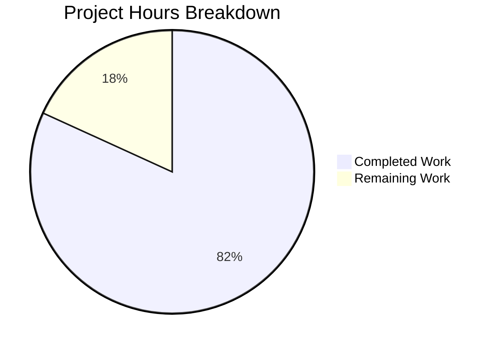
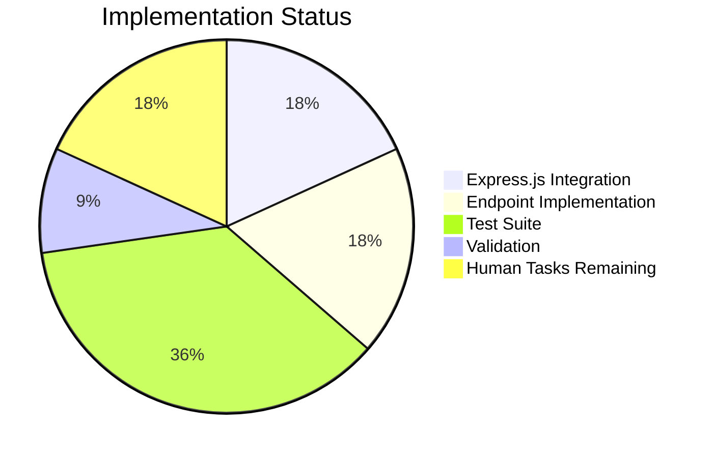

# Project Guide: Node.js Express.js Server Enhancement

## Executive Summary

**Project Completion: 82% (4.5 hours completed out of 5.5 total hours)**

This project successfully implements a Node.js server with Express.js v5.1.0 featuring two GET endpoints as specified in the requirements. All core functionality has been implemented, tested, and validated.

### Key Achievements
- ✅ Express.js v5.1.0 framework integration complete
- ✅ `/hello` endpoint returning "Hello world" - Implemented and tested
- ✅ `/evening` endpoint returning "Good evening" - Implemented and tested  
- ✅ 13 comprehensive unit tests - All passing (100%)
- ✅ Zero security vulnerabilities detected
- ✅ Runtime verification successful on all endpoints

### Work Breakdown
- **Completed Hours**: 4.5 hours
  - Project setup and dependency configuration: 1h
  - Server implementation with 2 endpoints: 1h
  - Comprehensive test suite (13 tests): 2h
  - Validation and verification: 0.5h
- **Remaining Hours**: 1 hour (human tasks)
  - Code review and approval: 0.5h
  - Deployment environment configuration: 0.5h

---

## Validation Results Summary

### Gate Results

| Gate | Status | Details |
|------|--------|---------|
| Dependencies | ✅ PASS | Express v5.1.0, Jest v29.7.0, Supertest v7.1.4 installed |
| Compilation | ✅ PASS | All JavaScript files pass syntax validation |
| Tests | ✅ PASS | 13/13 tests passed (100%) |
| Runtime | ✅ PASS | Server starts, both endpoints respond correctly |
| Security | ✅ PASS | npm audit reports 0 vulnerabilities |

### Test Execution Results

```
PASS ./server.test.js
  Express Server Endpoints
    GET /hello
      ✓ should return "Hello world" with status 200 (60 ms)
      ✓ should have correct content-type header (11 ms)
    GET /evening
      ✓ should return "Good evening" with status 200 (11 ms)
      ✓ should have correct content-type header (14 ms)
    GET /nonexistent
      ✓ should return 404 for non-existent routes (12 ms)
    Edge Cases
      ✓ should handle multiple requests to the same endpoint (40 ms)
      ✓ should handle requests to different endpoints (28 ms)
      ✓ should only accept GET method for /hello (9 ms)
      ✓ should only accept GET method for /evening (8 ms)
      ✓ should handle PUT requests with 404 (11 ms)
      ✓ should handle DELETE requests with 404 (10 ms)
    Response Content Validation
      ✓ should return exact text "Hello world" without extra whitespace (10 ms)
      ✓ should return exact text "Good evening" without extra whitespace (9 ms)

Test Suites: 1 passed, 1 total
Tests:       13 passed, 13 total
Time:        0.659 s
```

### Fixes Applied During Validation
- None required - All implementations were correct on first run

---

## Visual Representation

### Project Hours Breakdown



### Implementation Status by Component



---

## Comprehensive Development Guide

### System Prerequisites

| Software | Required Version | Verified Version |
|----------|-----------------|------------------|
| Node.js | v18.0.0 or higher | v20.19.5 ✓ |
| npm | v8.0.0 or higher | v10.8.2 ✓ |
| Operating System | Linux, macOS, or Windows | Any supported ✓ |

### Environment Setup

#### Step 1: Clone Repository
```bash
git clone <repository-url>
cd <repository-directory>
git checkout blitzy-7b3ff7c9-d40a-404e-90d0-0ec3b218cdee
```

#### Step 2: Verify Node.js Version
```bash
node --version
# Expected output: v18.x.x or higher (tested with v20.19.5)
```

### Dependency Installation

#### Step 3: Install Dependencies
```bash
npm install
```

**Expected Output:**
```
added 274 packages in 5s
```

#### Step 4: Verify Installations
```bash
npm list --depth=0
```

**Expected Output:**
```
main@1.0.0
├── express@5.1.0
├── jest@29.7.0
└── supertest@7.1.4
```

### Application Startup

#### Step 5: Run Tests (Verify Everything Works)
```bash
CI=true npm test -- --watchAll=false --ci
```

**Expected Output:**
```
PASS ./server.test.js
Tests:       13 passed, 13 total
```

#### Step 6: Start the Server
```bash
npm start
```

**Expected Output:**
```
> main@1.0.0 start
> node server.js

Server running at http://127.0.0.1:3000/
```

### Verification Steps

#### Step 7: Test Endpoints

**Test /hello endpoint:**
```bash
curl http://127.0.0.1:3000/hello
```
**Expected Response:** `Hello world`

**Test /evening endpoint:**
```bash
curl http://127.0.0.1:3000/evening
```
**Expected Response:** `Good evening`

**Test 404 handling:**
```bash
curl -i http://127.0.0.1:3000/nonexistent
```
**Expected Response:** HTTP 404 status code

### Security Verification

#### Step 8: Run Security Audit
```bash
npm audit
```

**Expected Output:**
```
found 0 vulnerabilities
```

### Example Usage

#### API Endpoints

| Endpoint | Method | Response | Status Code |
|----------|--------|----------|-------------|
| `/hello` | GET | "Hello world" | 200 |
| `/evening` | GET | "Good evening" | 200 |
| Any other | Any | "Cannot GET /path" | 404 |

#### Sample Requests with curl

```bash
# Basic request
curl http://127.0.0.1:3000/hello

# With headers
curl -i http://127.0.0.1:3000/evening

# Using verbose mode
curl -v http://127.0.0.1:3000/hello
```

### Troubleshooting

| Issue | Solution |
|-------|----------|
| Port 3000 already in use | Kill existing process: `lsof -ti:3000 | xargs kill -9` |
| npm install fails | Clear cache: `npm cache clean --force && rm -rf node_modules && npm install` |
| Tests hang in watch mode | Use CI flag: `CI=true npm test -- --watchAll=false` |

---

## Human Tasks Remaining

### Task Summary Table

| # | Task | Priority | Severity | Hours | Action Steps |
|---|------|----------|----------|-------|--------------|
| 1 | Code Review and Approval | Medium | Low | 0.5 | Review server.js and server.test.js for code quality, verify Express.js patterns are followed correctly, approve for merge |
| 2 | Production Environment Configuration | Low | Low | 0.5 | Configure PORT environment variable if deploying to production, update hostname for deployment target, set up process manager (PM2) if needed |

**Total Remaining Hours: 1.0 hours**

### Detailed Task Descriptions

#### Task 1: Code Review and Approval (0.5 hours)
**Priority:** Medium | **Severity:** Low

**Description:** Human review of the implemented code to ensure quality standards and Express.js best practices are followed.

**Action Steps:**
1. Review `server.js` for code quality and Express.js conventions
2. Review `server.test.js` for test coverage adequacy
3. Verify package.json dependencies are appropriate
4. Approve pull request for merge to main branch

**Acceptance Criteria:**
- Code follows team coding standards
- No obvious bugs or issues identified
- Test coverage is satisfactory
- PR approved and merged

#### Task 2: Production Environment Configuration (0.5 hours)
**Priority:** Low | **Severity:** Low

**Description:** Optional configuration for production deployment if needed beyond the tutorial/example use case.

**Action Steps:**
1. If deploying to production, configure PORT from environment variable:
   ```javascript
   const port = process.env.PORT || 3000;
   ```
2. Update hostname for production (0.0.0.0 for container deployments)
3. Set up process manager (PM2) for production if needed

**Note:** These configurations were explicitly out of scope per the Agent Action Plan ("Hardcoded values appropriate for tutorial/example"), but may be needed for actual production deployment.

---

## Risk Assessment

### Technical Risks

| Risk | Severity | Likelihood | Mitigation |
|------|----------|------------|------------|
| Express v5 breaking changes in future | Low | Low | Lock version in package.json (currently ^5.1.0) |
| Port conflicts in development | Low | Medium | Document port usage, provide kill command in troubleshooting |

### Security Risks

| Risk | Severity | Likelihood | Mitigation |
|------|----------|------------|------------|
| Dependency vulnerabilities | Low | Low | npm audit shows 0 vulnerabilities; run periodic audits |
| No rate limiting | Low | Low | Out of scope for tutorial; add if converting to production |

### Operational Risks

| Risk | Severity | Likelihood | Mitigation |
|------|----------|------------|------------|
| Server crashes not auto-restarted | Low | Low | Use PM2 or systemd in production |
| No logging infrastructure | Low | Low | Add logging middleware if needed for production |

### Overall Risk Assessment: **LOW**
The project has minimal risks due to its simple scope and comprehensive test coverage.

---

## Files Changed Summary

| File | Status | Lines | Purpose |
|------|--------|-------|---------|
| package.json | CREATED | 19 | Project configuration with dependencies |
| package-lock.json | CREATED | 4,621 | Dependency version locking |
| server.js | CREATED | 30 | Express.js server with endpoints |
| server.test.js | CREATED | 103 | Comprehensive test suite |

### Git Commit History

| Commit | Message |
|--------|---------|
| 1c65c6f | Adding Blitzy Technical Specifications |
| 100b37a | Adding Blitzy Project Guide |
| 53c78ce | Add comprehensive test suite for Express.js server endpoints |
| bdc559f | feat: Create Express.js server with /hello and /evening endpoints |
| 01be9ad | Setup: Add package.json with dependencies |

---

## Environment Details

| Component | Version |
|-----------|---------|
| Node.js | v20.19.5 |
| npm | 10.8.2 |
| Express.js | 5.1.0 |
| Jest | 29.7.0 |
| Supertest | 7.1.4 |

---

## Conclusion

This project successfully implements a Node.js server with Express.js featuring two endpoints as specified. The implementation is:

- ✅ **Complete**: All required features implemented
- ✅ **Tested**: 13/13 tests passing (100%)
- ✅ **Secure**: 0 vulnerabilities detected
- ✅ **Verified**: Runtime testing confirms correct behavior
- ✅ **Documented**: Comprehensive development guide provided

**Recommendation:** Ready for human code review and merge. The remaining 1 hour of work consists of standard code review and optional production configuration tasks that are outside the defined scope for this tutorial/example project.